# 🛡️ TerraSecure

### Rover-Based Landmine Detection & Mapping

TerraSecure is a landmine detection rover developed as a university project that combines **embedded systems, robotics, wireless communication, metal detection sensing, GPS navigation, and desktop-based mission mapping**.

The system is built around **three hardware nodes**: an ESP32-powered rover with a pulse-induction metal detector, an ESP32 handheld controller that also acts as the USB bridge to the PC, and a desktop application that tracks the rover live on a map, logs every metal detection with its GPS coordinates, and lets the operator command the rover — manually or fully autonomously within a user-defined boundary.

---

# 🏆 Achievement


**TerraSecure** was developed as part of the **Microprocessor & Microcontroller Laboratory** course project and was presented at **United International University’s Project Showcase**.

The project received recognition at the showcase, with the team achieving 🥉<span style="color: #58a6ff;">**3rd Runner-Up**</span> .

> **Team:** **Agro Genesis**  
> **Course:** **Microprocessor & Microcontroller Laboratory**  
> **Achievement:** 🥉 **3rd Runner-Up**  
> **Trimester:** **243**

<table align="center">
  <tr>
    <td align="center">
      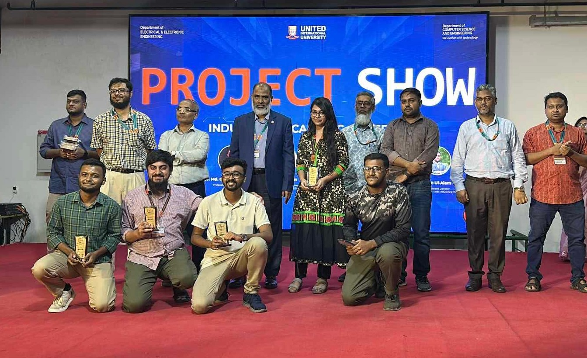
      <br>
    </td>
    <td align="center">
      
      <br>
    </td>
  </tr>
</table>

---


# 🎯 Motivation

Post-war fields can contain unexploded landmines and other metallic hazards that remain a serious threat to civilians, workers, and communities returning to affected areas. Manually searching these fields is dangerous, time-consuming, and requires significant human effort. There is a need for a safer and more accessible approach to identifying suspicious metallic objects before further investigation.

**TerraSecure** was developed as a **safer and cost-effective solution** by combining a mobile rover with a **pulse-induction metal detection system**. The rover can remotely scan an area, detect suspicious metallic objects, determine their GPS locations, and physically mark the detected locations for further investigation. This approach reduces the need for direct human exposure to potentially hazardous areas while providing a practical and affordable platform for landmine detection and mapping.

---

# 🏗️ System Architecture

<center>
  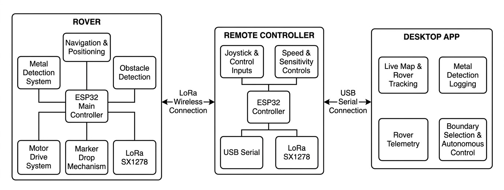
  <br>
  <em>System architecture — all three nodes and their communication links.</em>
</center>


TerraSecure is organized into three interconnected nodes: the **Rover**, **Remote Controller**, and **Desktop Application**. Together, these units provide remote operation, metal detection, location tracking, physical marking, and mission monitoring.

### 🚙 Rover

The **Rover** is the main field unit responsible for detection, navigation, and movement. An **ESP32 Main Controller** coordinates the GPS, MPU6050 and compass, ultrasonic obstacle sensor, motor driver, and LoRa communication. The rover also carries a dedicated **pulse-induction metal detection system** with a search coil and sensor MCU. The system analyzes the coil's decay signal using a **12-bit ADC** to detect suspicious metallic objects and report their signal strength. When a detection is confirmed, the **marker mechanism** can physically mark the location using two servos.

### 🎮 Remote Controller

The **Remote Controller** provides the operator with direct control of the rover through **joysticks**, while potentiometers allow adjustment of speed and detection sensitivity. A dedicated button can be used for marker control. Its ESP32 also acts as a communication bridge, connecting the desktop application through **USB Serial** and communicating with the rover wirelessly through the **LoRa SX1278**.

### 🖥️ Desktop Application

The **Desktop Application** serves as the main operator interface. It provides a live map for tracking the rover and displaying detected locations, while the telemetry interface shows important rover status information such as heading, tilt, battery, speed, and sensitivity. The application also maintains a metal-detection log and provides a **four-point boundary workflow** for defining an area for autonomous rover operation.


---

# 📸 Project Showcase

## Rover Pictures

<table align="center">
  <tr>
    <td align="center">
      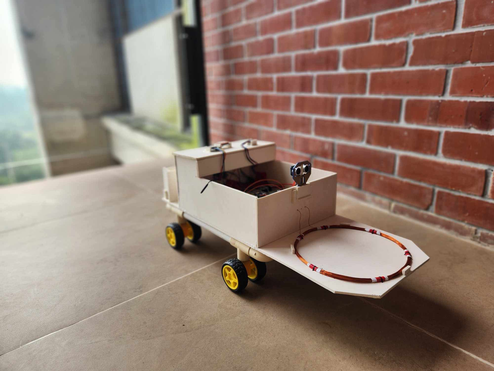
      <br>
      <em>Rover — Full View</em>
    </td>
    <td align="center">
      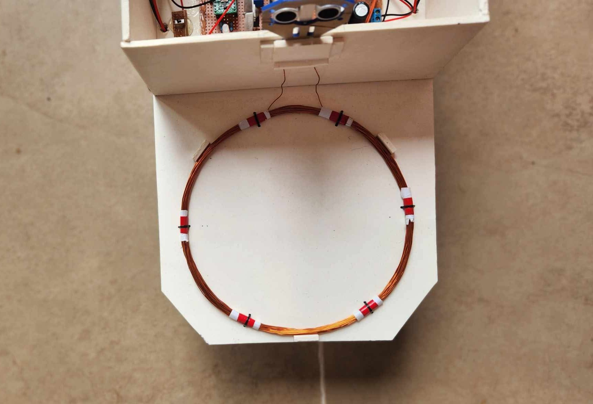
      <br>
      <em>Rover — Front View (metal detector coil on top)</em>
    </td>
  </tr>
  <tr>
    <td align="center" colspan="2">
      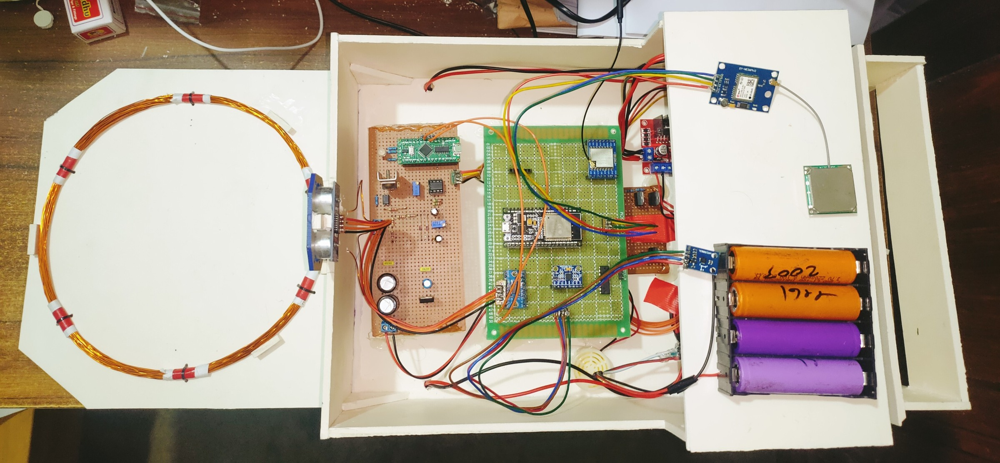
      <br>
      <em>Rover — Top View (coil + circuit module)</em>
    </td>

  </tr>
</table>

---

## Remote Controller

<table align="center">
  <tr>
    <td align="center">
      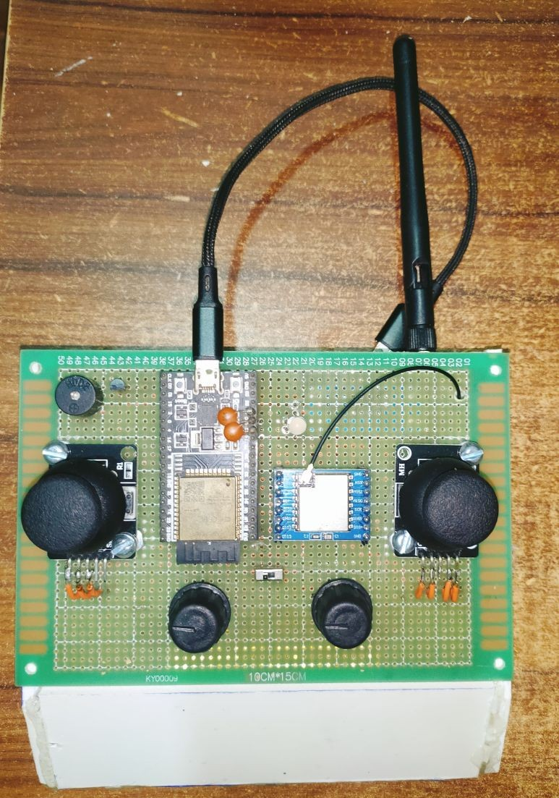
      <br>
      <em>Controller — after building </em>
    </td>
    <td align="center">
      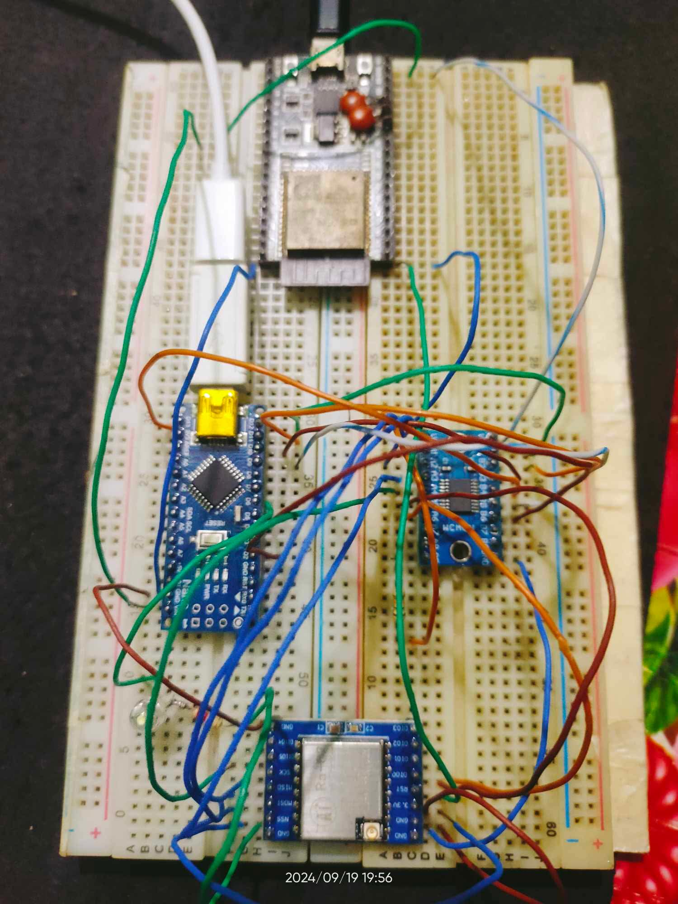
      <br>
      <em>Controller — Testing before building</em>
    </td>
  </tr>
</table>

*Custom ESP32-based handheld controller with joystick, two potentiometers, and a drop button.*

---

## Metal Sensor

<table align="center">
  <tr>
    <td align="center">
      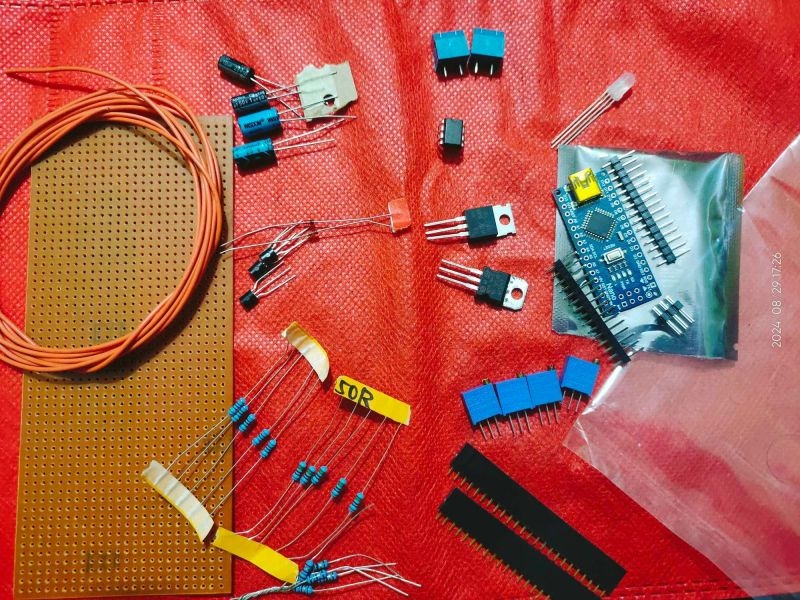
      <br>
      <em>Sensor Build — Before Soldering (all components)</em>
    </td>
    <td align="center">
      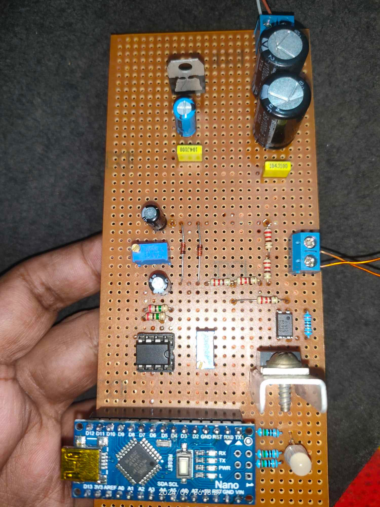
      <br>
      <em>Sensor Build — After Soldering</em>
    </td>
  </tr>
</table>

### How Pulse-Induction Detection Works

The sensor is a **pulse-induction (PI) metal detector** — one of the most effective technologies for finding buried metal, because it works through soil, sand, and water without any ground-tuning.

<center>
  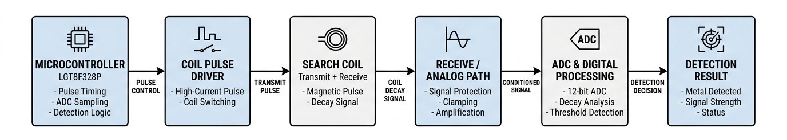
  <br>
  <em>Pulse-induction metal detector — sensor block diagram.</em>
</center>

The principle is simple and powerful:

1. The microcontroller drives **a short, strong current pulse** (150 µs) through the search coil, energizing its magnetic field.
2. When the pulse is cut off, the field **collapses and induces a decaying voltage** in the coil — this decay is what the detector listens to.
3. If metal is buried beneath the coil, **eddy currents induced in the metal** slow that decay down in a measurable way.
4. After a short **90 µs settling delay**, the 12-bit ADC samples the decay level. The stronger the metal response, the lower the sampled value.
5. When that signal crosses the operator-set sensitivity threshold, the detector declares metal present.

The result is sent to the rover over I2C as a **metal present flag + a 0–100% strength reading**, so the rover can stop, log the GPS position, and trigger the marker drop.

---

## Drop Mechanism

<table align="center">
  <tr>
    <td align="center">
      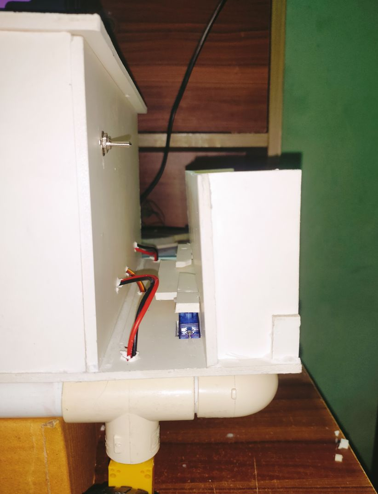
      <br>
      <em>Marker Drop Mechanism — Side View</em>
    </td>
    <td align="center">
      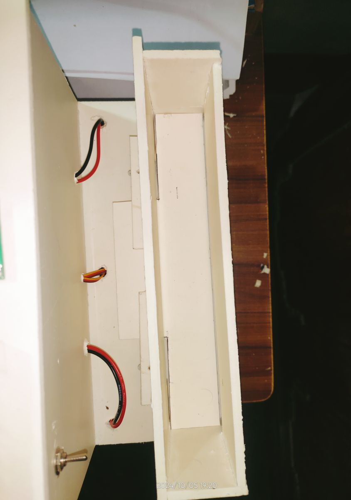
      <br>
      <em>Marker Drop Mechanism — Front View</em>
    </td>
  </tr>
</table>

*Two SG90 servos sweep in opposite directions to push a marker flag off the rover and onto the exact detection spot.*

---

## 💻 Software Showcase

### Dashboard

The desktop dashboard provides a centralized view of **real-time rover telemetry and mission status**. It displays **GPS position on a live map, battery level, rover speed, sensor sensitivity, compass heading, pitch/roll attitude, and every metal detection plotted at its exact coordinates**.

The left panel keeps a **detection log** with timestamps, coordinates, and signal strength — all stored permanently in a CSV database that can be downloaded, uploaded, or cleared at any time.

<center>
  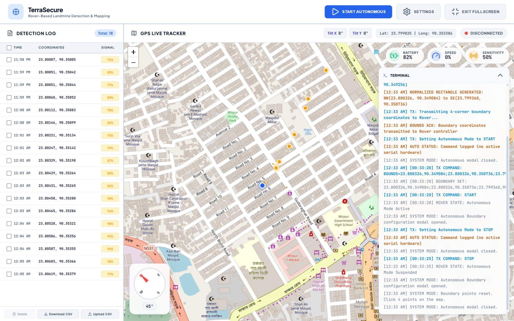
  <br>
  <em>Software showcase — real-time rover monitoring and landmine detection dashboard.</em>
</center>


---

# 🧭 Boundary-Constrained Autonomous Navigation

The rover operates within a **user-defined rectangular boundary** selected directly on the map by clicking 4 corner points. The software normalizes the points into a perfect rectangle and transmits the coordinates to the rover over LoRa.

Once **START** is issued, the rover sweeps the enclosed area in a **lawn-mower (stripe) pattern** using GPS waypoints, automatically dodges obstacles detected by its ultrasonic sensor, stops over confirmed metal signatures for the marker-drop mechanism to actuate, and always steers back inside the boundary if it drifts out.

<p align="center">
  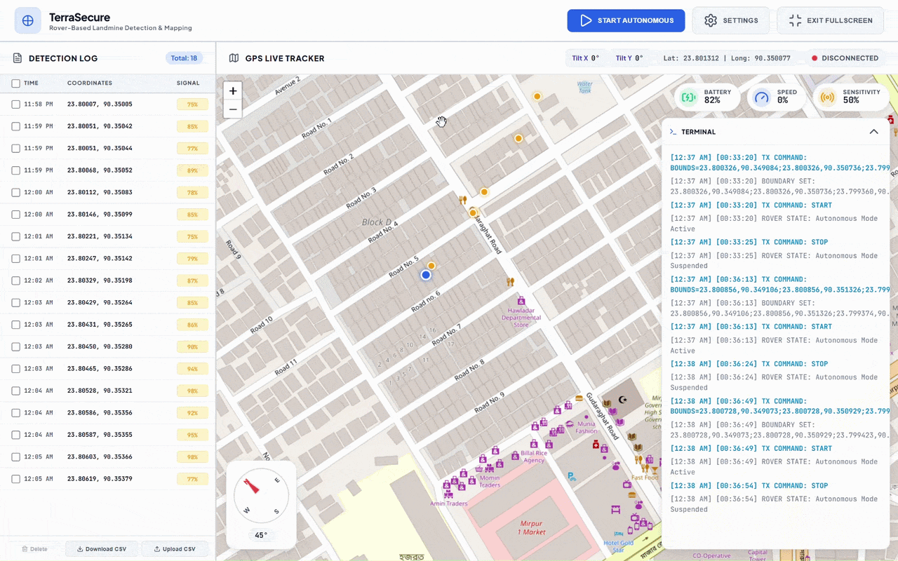
  <br>
  <em>Defining the 4-point boundary on the map and starting autonomous operation.</em>
</p>

---

# 🚀 Getting Started

The system has three nodes that talk to each other over **LoRa** (rover ↔ controller), **USB** (controller ↔ desktop), and **I2C** (rover ↔ metal sensor).

## 1. Desktop Application (Windows)

opens the software in a native pywebview window (no browser needed)

```bash
cd Software
pip install -r requirements.txt
python launcher.py       
```

To run in a regular browser instead (access through http://localhost:3000):

```bash
python app.py            
```

To build a standalone Windows EXE:

```bash
pip install pyinstaller
pyinstaller --noconsole --onefile --name TerraSecure --add-data "templates;templates" --add-data "static;static" launcher.py
```

- Plug the ESP32 controller into the PC over USB (it should expose a **CP2102** serial port — check Device Manager).
- Open **SETTINGS**, select the COM port, and keep the baud rate at **115200** (matching the controller firmware).


## 2. Firmware — the three boards

Open the sketches in the **Arduino IDE**:

1. Add the **ESP32** board support: `File → Preferences → Additional boards manager URLs` → `https://dl.espressif.com/dl/package_esp32_index.json`, then install `esp32` from the Boards Manager.
2. For the sensor board, install the **LGT8FX** core (LGT8F328P support) so `analogReadResolution(12)` works.
3. Install the libraries from the Library Manager: **LoRa** (by Sandeep Mistry), **MPU6050**, **QMC5883LCompass**, **Servo**, **Wire** (built-in).
4. Upload the correct sketch to each board:

| Sketch | Board | Location |
|---|---|---|
| `rover/` | ESP32 | on the rover (LoRa + GPS + sensors + motors, I2C master @ `0x08`) |
| `controller/` | ESP32 | the handheld controller (USB ⇄ LoRa bridge) |
| `metal_sensor/` | LGT8F328P | the metal detector + servo drop mechanism (I2C slave @ `0x08`) |

Both ESP32 radios use **433 MHz** — set the SX1278 modules (rover + controller) to the same frequency and antenna length.

---


# 📡 Communication Protocol

## Downlink (Desktop → Controller → Rover, LoRa)

| Command | Meaning |
|---|---|
| `F` / `B` / `R` / `L` | Manual move (forward / backward / right / left) |
| `d` | Drop a physical marker at the current location |
| `g<0-20>` | Set speed level (potentiometer scale) |
| `s<0-25>` | Set sensitivity level (inverted — knob up = more sensitive) |
| `START` / `STOP` | Autonomous mode on / off |
| `BOUNDS=nw;ne;se;sw` | 4-corner boundary as `lat,lon;lat,lon;...` |

## Uplink (Rover → Controller → Desktop, LoRa → USB)

| Format | Meaning |
|---|---|
| `[x,lat,lon,heading,battery,tiltx,tilty,speed,sens]` | Periodic telemetry frame (1 Hz) |
| `d,lat,lon,strength` | Metal detection event (strength 0–100%) |
| `<speed,sens>` | Controller beacon to the HMI (both 0–100%) |

## I2C Slave (Rover → Metal Sensor)

- Master requests **2 bytes**: `'T'`/`'F'` (metal present) + signal strength (0–100)
- Master writes `'d'` → actuate the servo drop mechanism
- Master writes a number → set sensitivity threshold (0–625)

---

# 🚜 Rover Hardware

| Component | Purpose |
| ------------------------------- | ------------------------------- |
| **ESP32 Dev Board** | Main control + LoRa + multitasking |
| **LoRa SX1278** | Wireless link to the controller (433 MHz) |
| **NEO-8M GPS** | Position tracking |
| **MPU6050** | Pitch/roll attitude measurement |
| **QMC5883L Compass** | Heading/orientation measurement |
| **HC-SR04 Ultrasonic** | Obstacle detection for auto-dodge |
| **Shift Register (74HC595)** | LED/buzzer/motor-direction control |
| **DC Gear Motors + Driver** | Wheel drive |
| **Metal Detector (LGT8F328P)** | Pulse-induction detection + marker drop |

---

# 🎮 Remote Controller Hardware

| Component | Purpose |
| ------------------------------- | ------------------------------- |
| **ESP32** | Controller and USB ⇄ LoRa bridge |
| **Joystick** | Rover movement control |
| **2× Potentiometers** | Speed and sensitivity adjustment |
| **Drop Button** | Manual marker drop |
| **LoRa SX1278** | Rover communication |
| **Buzzer + LEDs** | Operator feedback |
| **USB** | Connection to desktop software |

---

# 🧲 Metal Sensor Hardware

| Component | Purpose |
| ------------------------------- | ------------------------------- |
| **LGT8F328P** | I2C slave, 12-bit ADC, coil pulse timing |
| **Search Coil** | Pulse-induction detection field |
| **2× SG90 Servos** | Marker drop mechanism |
| **LEDs** | Visual metal detection feedback |

---

# 📡 Why LoRa?

The rover communicates with the remote controller using an **SX1278 LoRa module** at 433 MHz.

This provides a **long-range wireless communication link**, ideal for field-scale operations where Wi-Fi/Bluetooth range would be insufficient — all control commands, telemetry, and detection events fit comfortably within its bandwidth, and it operates with minimal power on both the rover and the handheld controller.

---

## 🛠️ Technology Stack

| **System Layer** | **Technologies & Components** |
|---|---|
| **Rover Firmware** | ESP32, FreeRTOS, C/C++ |
| **Metal Detection** | LGT8F328P, Pulse-Induction (PI) Detection, 12-bit ADC, I2C |
| **Navigation & Sensing** | NEO-8M GPS, MPU6050, HMC5883L Compass, HC-SR04 Ultrasonic |
| **Wireless & Serial Communication** | LoRa SX1278, USB Serial, I2C |
| **Remote Controller** | ESP32, Joysticks, Potentiometers, LoRa SX1278 |
| **Desktop Application** | Python, Flask, pywebview, Leaflet.js, HTML, CSS, JavaScript |
| **Data Management** | CSV-based Detection Database |


# 📁 Repository Structure

```text
TerraSecure/
│
├── rover/                                # Rover firmware (ESP32)
│   ├── rover.ino                         # main rover program (8 FreeRTOS tasks)
│   ├── shift.ino                         # shift-register motor/LED/buzzer driver
│   ├── sensor.ino                        # I2C driver for the metal sensor slave
│   └── sd_card.ino                       # SD card helpers
│
├── controller/                           # Handheld controller firmware (ESP32)
│   └── controller.ino                    # joystick/pots + USB ⇄ LoRa bridge
│
├── metal_sensor/                         # Metal sensor firmware (LGT8F328P)
│   └── metal_sensor.ino                  # pulse-induction detector + servo drop
│
├── Software/                             # Desktop application
│   ├── app.py                            # Flask backend (REST API + static files)
│   ├── launcher.py                       # pywebview entry point (native window)
│   ├── requirements.txt
│   ├── server/
│   │   └── utilities.py                  # serial driver, parser, CSV database
│   ├── templates/
│   │   └── index.html                    # HMI single-page dashboard
│   ├── static/
│   │   ├── css/style.css
│   │   └── js/app.js
│   └── data/
│       └── targets.csv                   # runtime detection database
│
├── docs/
│   └── images/                           # screenshots & build photos used in this README
│       ├── architecture/
│       ├── build/
│       └── gallery/
│
└── README.md
```

